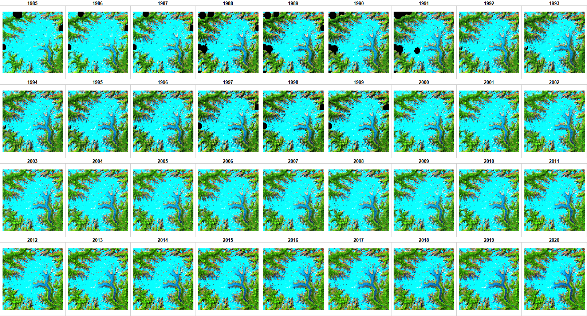
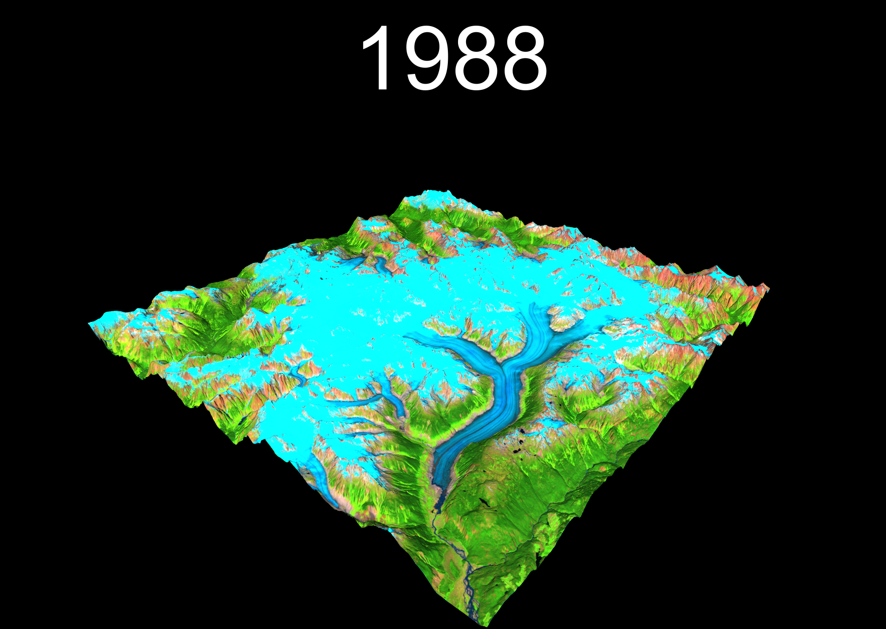

<link rel="stylesheet" href="styles.css" type="text/css">\
<link rel="stylesheet" href="academicicons/css/academicons.min.css"/>

Last updated `r lubridate::today()`

```{r setup, include = FALSE}
knitr::opts_chunk$set(
	eval = FALSE,
	message = FALSE,
	warning = FALSE,
	include = TRUE
)
```

The purpose of this page is to demonstrate how to make a 3D timelapse animation from Landsat imagery.

{width="282"}

# Setup your project

## Load libraries

First load the follwoing libraries:

```{r libraries}

# LANDSAT MOSAICS 
library(mapedit)
library(rgee)
library(sf)

# GAP FILL TIMESERIES
library(stars)
library(forecast)

# RAYSAHDER 
library(raster)
library(rayshader)

# ANIMATION
library(gifski)

# PARALLEL 
library(future)
library(future.apply)

```

## Initialize GEE

Then connect to GEE, more info on connecting your Earth Engine credentials can be found here: <https://r-spatial.github.io/rgee/reference/ee_Initialize.html>.

```{r initialize}
rgee::ee_Initialize(email = "bevingtona", drive = T)
```

## Area of interest

Define your area of interest as an `sf` polygon. In the commented code below, I use the `mapedit` package to digitize an `aoi`, then I save it locally to reproduct the workflow. The polygon is then loaded to Earth Engine.

*Tip: Keep the polygon simple, ideally just a rectangle.* *Tip: The larger the polygon, the slower the workflow, start small!*

```{r aoi}
project_name <- "klini_lg" #unique name for the project
# aoi <- mapedit::editMap()
# write_sf(aoi, paste0(project_name,".gpkg"))
aoi <- read_sf(paste0(project_name,".gpkg"))
aoi_ee <- rgee::sf_as_ee(aoi)$geometry()
Map$centerObject(aoi_ee)
Map$addLayer(aoi_ee)
```

## Set project settings

Here we set up the project with key variables for the rest of the script. Most are intuitive, but I've added some comments to help explain.

```{r proj}
cloud <- 10 # Landsat metadata cloud cover threshold 
monthStart <- 7 # filter months included in mosaics. 
monthEnd <- 9 # filter months included in mosaics.
yearStart <- 1985 # filter year included in mosaics.
yearEnd <- 2020 # filter year included in mosaics.
yearWindow <- 2 # if 0 mosaics are for 1 year, if 1 then for +- 1 year
yearInterval <- 1 # if 1 then mosaic every year, if 10 then every 10 years. 
years <- seq(yearStart, yearEnd, yearInterval)
cloudBuffer <- 3000 # cloud buffer distance in m
gdrive <- "E:/Google Drive/" # location of google drive locally for files to sync

outfolder_name <- paste(
  project_name,
  cloud,
  monthStart,
  monthEnd,
  yearStart,
  yearEnd,
  yearInterval,
  yearWindow,
  cloudBuffer,
  sep = "_"
)
```

# RGEE

The goal of using Google Earth Engine is to quickly make annual cloud-free mosaics and clip them to our area of interest.

*Tip: the script assumes that you use "Backup and Sync to automatically sync your Google Drive to your desktop*

## Landsat functions

```{r functions}

# Function to scale Surface Reflectance values
srScale = function(img) {
  img$addBands(img$select(c(
    'blue', 'green', 'red', 'nir', 'swir1', 'swir2'
  ))$multiply(0.0001))$addBands(img$select(c('tir'))$multiply(0.1))$select(
    c('blue_1','green_1','red_1','nir_1','swir1_1','swir2_1','tir_1'),
    c('blue', 'green', 'red', 'nir', 'swir1', 'swir2', 'tir')
  )
}

# Function to remove saturated values
radiometric = function(img) {
  blue = img$select('blue')$eq(2)
  blueAdd = img$select('blue')$subtract(blue)
  green = img$select('green')$eq(2)
  greenAdd = img$select('green')$subtract(green)
  red = img$select('red')$eq(2)
  redAdd = img$select('red')$subtract(red)
  img$addBands(blueAdd)$addBands(greenAdd)$addBands(redAdd)$select(
    c('blue_1', 'green_1', 'red_1', 'nir', 'swir1', 'swir2', 'tir'),ST_NAMES)
}

# Function to apply cloud mask and buffer based on NDCI.
cloudMask = function(img) {
  temp  = img$addBands(img$select('tir')$unitScale(240, 270))
  temp  = temp$addBands(temp$normalizedDifference(c('tir_1', 'swir2'))$rename('ndci'))
  temp  = temp$addBands(temp$select('ndci')$lte(0.5)$rename('ndciT'))
  mask  = temp$select('ndciT')$fastDistanceTransform(51, 'pixels', 'squared_euclidean')$
    sqrt()$multiply(ee$Image$pixelArea()$sqrt())$gt(cloudBuffer)
  img$updateMask(mask)
}

```

## Landsat collections

```{r landsat}

# Load collections
L4SR1 <- ee$ImageCollection('LANDSAT/LT04/C01/T1_SR')
L5SR1 <- ee$ImageCollection('LANDSAT/LT05/C01/T1_SR')
L7SR1v1 <- ee$ImageCollection('LANDSAT/LE07/C01/T1_SR')$
  filterDate('1999-01-01', '2003-01-01')
L7SR1v2 <- ee$ImageCollection('LANDSAT/LE07/C01/T1_SR')$
  filterDate('2012-01-01', '2013-01-01')
L8SR1 <- ee$ImageCollection('LANDSAT/LC08/C01/T1_SR')

# Load bands
LT_BANDS <- c('B1', 'B2', 'B3', 'B4', 'B5', 'B7', 'B6')
LE_BANDS <- c('B1', 'B2', 'B3', 'B4', 'B5', 'B7', 'B6')
LC_BANDS <- c('B2', 'B3', 'B4', 'B5', 'B6', 'B7', 'B10')
ST_NAMES <- c('blue', 'green', 'red', 'nir', 'swir1', 'swir2', 'tir')

# Merge collections and pre-process images
col = L4SR1$select(LT_BANDS, ST_NAMES)$merge(
      L5SR1$select(LT_BANDS, ST_NAMES))$merge(
      L7SR1v1$select(LE_BANDS, ST_NAMES))$merge(
      L7SR1v2$select(LE_BANDS, ST_NAMES))$merge(
      L8SR1$select(LC_BANDS, ST_NAMES))$
  filterBounds(aoi_ee)$filterMetadata('CLOUD_COVER', 'less_than', cloud)$
  filter(ee$Filter$calendarRange(yearStart, yearEnd, "year"))$
  filter(ee$Filter$calendarRange(monthStart, monthEnd, "month"))$
  map(srScale)$
  map(radiometric)$
  map(cloudMask)

# Set Viz params, for visualization and export
vizParams <-
  list(bands = c("swir1", "nir", "red"),
       min = 0,
       max = 0.4)

# Check image
col$mean() %>% Map$addLayer(visParams = vizParams)

```

## Download annual mosaics

```{r annualmosaic}
out <- lapply(seq(yearStart, yearEnd, yearInterval), function(year) {
print(year)
  col_yr <- col$filter(ee$Filter$calendarRange(year - yearWindow,
                                               year + yearWindow,
                                               "year"))
  col_yr_median <- col_yr$median()
  col_yr_median_rgb <- do.call(col_yr_median$visualize, vizParams)
  task <- ee$batch$Export$image(
    image = col_yr_median_rgb,
    description = paste0(project_name, "_LS_", year),
    config = list(
      scale = 30,
      maxPixels = 1.0E13,
      crs = "EPSG:3005",
      driveFolder = outfolder_name,
      region = aoi_ee
      )
    )
  task$start()
  return(year)
  })
```

## Download DEM

SRTM is only available above 60°S and below 60°N. If you are wanting to run this outside of the DEM domain, please modify the code to use another dataset.

```{r dem}
mydem <- ee$Image("USGS/SRTMGL1_003")
task <- ee$batch$Export$image(
  image = mydem,
  description = paste0(project_name, "_DEM_SRTM"),
  config = list(
    scale = 30,
    maxPixels = 1.0E13,
    crs = "EPSG:3005",
    driveFolder = outfolder_name,
    region = aoi_ee
    )
  )
```

# Interpolate missing data

## Inspect tifs

```{r inspectTifs}

# LIST OF LANDSAT FILES
files_LS <- list.files(paste0(gdrive, outfolder_name), 
                       full.names = T,
                       pattern = "_LS_")

# REDIMENSION THE ENTIRE LIST TO MAKE A PLOT
rgb_LS <- read_stars(files_LS) %>% 
  st_rgb() %>% 
  st_redimension() 

rgb_LS <- rgb_LS %>% 
  st_set_dimensions(3, as.character(years))

rgb_LS %>% plot()
```



## Interpolate time series for each band

```{r}
dir.create(paste0(gdrive,outfolder_name,"/gap_fill"))
files_LS <-
  list.files(paste0(gdrive, outfolder_name),
             full.names = T,
             pattern = "_LS_")

years <- seq(yearStart,yearEnd,yearInterval)

my_func_ma <- function(vals) {
  vals[vals==0] <- NA
  if(sum(is.na(vals))<25){
    return(as.numeric(forecast::na.interp(vals)))
    }else{
      return(vals)}}

slow_impute <- function(band_no){
  # READ STACK PER BAND
  band_stack <- read_stars(files_LS)[,,,band_no, drop = T] %>%
    st_redimension() 
  write_stars(band_stack, paste0(gdrive,outfolder_name,"/gap_fill/band",band_no,"_raw.tif"))
  # SMOOTH STACK
  band_stack_ma <- st_apply(band_stack,
                            MARGIN = c("x", "y"),
                            FUN = my_func_ma) %>%
    st_set_dimensions(which = 1,
                      values = as.character(years),
                      names = "year")
  write_stars(band_stack_ma, paste0(gdrive,outfolder_name,"/gap_fill/band",band_no,"_smooth.tif"))
  return(band_no)}

plan(multicore)

bands <- 1:3
band_test <- future_lapply(bands, slow_impute)
```

## Combine interpolated data into RGB images

```{r}
f <- list.files(paste0(gdrive,outfolder_name,"/gap_fill/"), pattern = "_smooth.tif", full.names = T)

plan(multisession)

bands <- 1:length(years)

rgb_creator <- function(j){
  i <- read_stars(f[1])[,,,j, drop = T]
  names(i) <- "swir1"
  i$nir <- read_stars(f[2])[,,,j,drop = T]
  i$red <- read_stars(f[3])[,,,j,drop = T]
  i <- i %>% st_redimension()
  write_stars(i, paste0(gdrive,outfolder_name,"/gap_fill/",years[j],"_final.tif"))
  return(j)}

band_test <- future_lapply(bands, rgb_creator)

```

# I can rayshade (a time series) and so can you!

You might need to tinker with the settings to get the best view of your site.

```{r rayshade}

if(SHOULD_I_RAYSHADE == T){
  
dir.create(paste0(gdrive,outfolder_name,"/rayshader_out/"), showWarnings = F)

  # LIST LANDSAT FILES 
files_LS <-
  list.files(paste0(gdrive, outfolder_name,"/gap_fill/"),
             full.names = T,
             pattern = "_final.tif")

# LIST DEM FILE
files_DEM <-
  list.files(paste0(gdrive, outfolder_name),
             full.names = T,
             pattern = "_DEM_")

# LOAD DEM 
dem <- raster::raster(files_DEM)
dem_matrix = rayshader::raster_to_matrix(dem, verbose = F)

# LOOP RAYSHADER FOR ALL YEARS

lapply(years, function(year){
  img <- raster::stack(files_LS[grep(paste0(year,"_final.tif"), files_LS)])
  
  names(img) = c("r", "g", "b")
  
  img_r = rayshader::raster_to_matrix(img$r, verbose = F)
  img_g = rayshader::raster_to_matrix(img$g, verbose = F)
  img_b = rayshader::raster_to_matrix(img$b, verbose = F)
  
  
  img_array = array(0, dim = c(nrow(img_r), ncol(img_r), 3))
  
  img_array[, , 1] = img_r / 255
  img_array[, , 2] = img_g / 255
  img_array[, , 3] = img_b / 255
  
  img_array = aperm(img_array, c(2, 1, 3))

  temp <- plot_3d(
    img_array,
    dem_matrix,
    windowsize = c(2000,2000),
    zscale = 20, # bigger is flatter
    baseshape = "rectangle",
    solid = TRUE,
    soliddepth = "auto",
    solidcolor = "black",
    solidlinecolor = "black",
    shadow = F,
    theta = 40, # SOUTH = 180
    phi = 30, # NADIR = 90
    fov = 60, #100 = fish-eye
    zoom = 0.8, # small = close
    background = "black"
  )

render_snapshot(
  filename = paste0(gdrive,outfolder_name,"/rayshader_out/",year,".png"),
  title_text = year,
  title_bar_color = "black",
  title_size = 2000*0.1,
  title_color = "white",
  title_position = "north",
  title_bar_alpha = 1
)

rgl::rgl.close()
})
}

```



# I can animate a `rayshader` overlay, and so can you!

## In 3D

The `gifski` package is crazy fast, especially compared to `magick`..

```{r animate}

dir.create(paste0(gdrive,outfolder_name,"/gif_out/"))
png_files <- list.files(paste0(gdrive,outfolder_name,"/rayshader_out/"), full.names = T)
gif_file <- paste0(paste0(gdrive,outfolder_name,"/animation3d.gif"))
gifski(png_files, gif_file,
       width = ncol(png::readPNG(png_files[1])),
       height = nrow(png::readPNG(png_files[1])),
       delay = 0.1,
       loop = TRUE,
       progress = TRUE)
```


## Or keep it `2D`

```{r}

dir.create(paste0(gdrive,outfolder_name,"/2Dtemp/"))
tif_files <- list.files(paste0(gdrive,outfolder_name,"/gap_fill/"), full.names = T, pattern = "final")

plan(multisession)
png_files <- future_lapply(years, function(year){
  out_name <- paste0(gdrive,outfolder_name,"/2Dtemp/", year, "v2.png")
  png(filename = out_name, width = 2000, height = 2000)
  read_stars(paste0(gdrive,outfolder_name,"/gap_fill/",year,"_final.tif")) %>% 
    plot(main = "", rgb = 1:3) 
  dev.off()
  return(out_name)})

gif_file <- paste0(paste0(gdrive,outfolder_name,"/animation2d.gif"))
gifski(unlist(png_files), gif_file,
       width = ncol(png::readPNG(unlist(png_files)[1])),
       height = nrow(png::readPNG(unlist(png_files)[1])),
       delay = 0.1,
       loop = TRUE,
       progress = TRUE)

```


