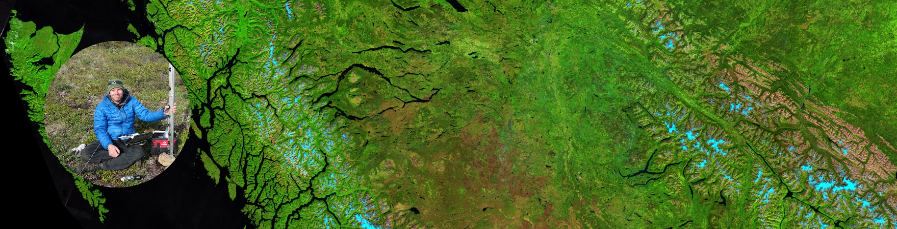

<link rel="stylesheet" href="styles.css" type="text/css"> <link rel="stylesheet" href="academicicons/css/academicons.min.css"/>

# Courses

[<b>GEOG 205</b> - Cartography and Geomatics](https://tools.unbc.ca/course-catalogue/?subj=GEOG&crse=205) (UNBC) [2026 Winter]

[<b>GEOG 450/650</b> - Advanced Geospatial Analysis](https://tools.unbc.ca/course-catalogue/?subj=GEOG&crse=450) (UNBC) [2025 Winter]

[<b>GEOG 457/657</b> - Advanced Remote Sensing](https://tools.unbc.ca/course-catalogue/?subj=GEOG&crse=457) (UNBC) [2026 Winter / 2024 Winter / 2022 Winter]

# Workshops

<b>Intermediate Python Remote Sensing</b> Feb 22-23, 2023 
Organized and co-taught with SparkGeo Ltd. a free workshop at UNBC for 40 participants from industry, government, academics, and First Nations. 	

<b>R Geospatial Machine Learning Workshop & Hackathon</b> Nov 5-7, 2019 
Organized and co-taught with Dr. Tomislav Hengl (OpenGeoHub Foundation) a free workshop at the SparkHub for 35 participants from industry, government, academics, and First Nations. 

<b>Advanced Satellite Remote Sensing Workshop</b> Mar 7-9, 2018 
Organized and taught a free workshop at the Ministry of Forests offices for 28 participants from industry, government, academics, and First Nations. 

<b>Introduction to Satellite Remote Sensing Workshop</b> Nov 22-24, 2017 
Organized and taught a free workshop at the Ministry of Forests offices for participants from industry, government, academics, and First Nations. 	

<b>Advanced Satellite Remote Sensing Workshop</b> Mar 7-9, 2017 
Organized and taught a free workshop at the Ministry of Forests offices for participants from industry, government, academics, and First Nations.

<b>Introduction to Satellite Remote Sensing Workshop</b> Jan 19-20, 2017 
Organized and taught a free workshop at the Ministry of Forests offices for participants from industry, government, academics, and First Nations.	

# Events

<b>Northern BC Stream Temperature Symposium</b> 
<b>Canadian Cartographic Association</b> 