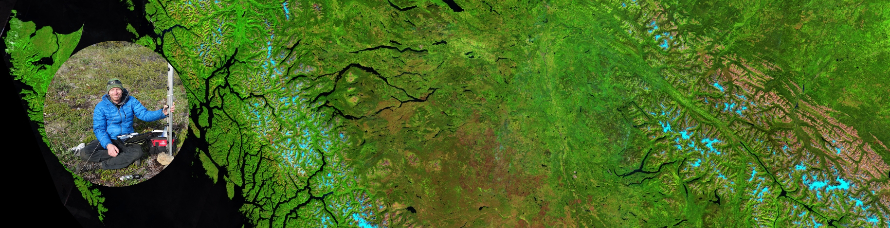

<link rel="stylesheet" href="../styles.css" type="text/css"> <link rel="stylesheet" href="../academicicons/css/academicons.min.css"/>

Hello! My name is Alex. I am a tenure-track lecturer at the [University of Northern British Columbia](https://www.unbc.ca/department-geography-earth-and-environmental-sciences). My interests are wide-ranging, but are generally captured by the following themes: Hydrology, Cryosphere, Geography, and Earth Observation. Link them all together to make *HYDRO-CRYO-GEO-EO!*

I'm part of the "[**Geospatial Watershed Lab**]{.underline}". The motivation of the lab is to tackle wicked problems in the world of water security and public safety, and contribute to solutions with science and research.

## Current Projects and Themes

***RemoteLogger*** -- *Low-cost real-time data loggers*\
<https://bcgov-env.shinyapps.io/nbchydro/>\
We are developing modular, low-cost, and low-power loggers for hydrological and environmental monitoring. These systems integrate in-situ sensors (e.g., water level, snow depth, water temperature) with real-time communication capabilities, offering scalable monitoring solutions for remote and underserved areas. RemoteLogger is designed to democratize access to environmental data by reducing costs while maintaining scientific-grade reliability.

***watershedBC*** -- *Interactive watershed information platform*\
<https://bcgov-env.shinyapps.io/watershedBC/>\
WatershedBC is an open-access decision-support tool that enables users to quickly visualize and extract key information about watersheds across British Columbia. Designed for practitioners, researchers, and the public, it leverages provincial datasets and automated workflows to deliver insights on hydrology, land cover, and climate attributes at nested watershed scales.

***Climate and Land Cover Change Impacts on Watersheds*** - This project addresses how changing climate regimes and land cover transformations (wildfire, forestry, urbanization) influence watershed processes. We are building large-scale, time-dynamic datasets to link hydrological responses---such as flooding, drought, erosion, sediment loading, and stream temperature---to environmental drivers. The project integrates remote sensing from multiple platforms (Landsat, Sentinel, PlanetScope, LiDAR) with watershed models to better forecast future water resource challenges in western Canada.

***Rapidly Changing Cryosphere*** - The cryosphere---including glaciers, snow, and permafrost---is one of the most visible indicators of climate change in western Canada. We combine in-situ measurements (mass balance, snow depth, borehole permafrost temperatures) with satellite observations and conceptual models to monitor change and explore its consequences for water resources, ecosystems, and communities. This work provides critical data for water supply planning, hazard assessments, and long-term climate adaptation strategies.

***Slope Stability Monitoring in BC with InSAR*** - Landslide hazards represent a significant risk to infrastructure and communities, particularly in mountainous terrain. This project focuses on building robust InSAR workflows using Sentinel-1, RADARSAT Constellation Mission, and future missions (e.g., NASA--ISRO NISAR) to detect and track precursory slope deformation. Our objective is to transition InSAR from a research tool into an operational, near-real-time monitoring system that can support emergency management and land-use planning.

***Water Temperature Dynamics in Freshwater Systems*** - Water temperature regulates ecological processes and habitat viability for fish and other aquatic life. We are integrating field-based temperature monitoring networks with thermal infrared remote sensing and hydrological models to better understand the spatial and temporal dynamics of stream and lake temperatures. These datasets will help predict thermal stress on ecosystems under climate change and guide management strategies for cold-water refugia.

***Integrated Remote Sensing Analysis*** - Our lab takes on a broad portfolio of remote sensing projects, reflecting the versatility of geospatial technologies. Current and past work includes: Time-series analysis of vegetation and disturbance dynamics; Development of novel cloud-free mosaic generation approaches; Multisensor fusion for forest attribute mapping; and Detection and attribution of human impacts on landscapes over time. This theme highlights classification, change detection, and statistical modeling of environmental processes using Earth observation data.