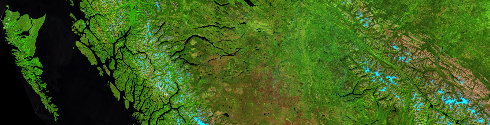

<link rel="stylesheet" href="styles.css" type="text/css"> <link rel="stylesheet" href="academicicons/css/academicons.min.css"/>

These days I wear a few hats:

-   Research hydrologist with the [Government of British Columbia](https://www2.gov.bc.ca/gov/content/environment/research-monitoring-reporting/research/flnrord-research-authors/alexandre-bevington).

-   PhD student at the [University of Northern British Columbia](www.unbc.ca)

-   President of the [Prince George Backcountry Recreation Society](www.pgbrs.org)

This website serves as a general purpose CV and is somewhere that I can share progress and thoughts on:

-   Earth Observation

-   Hydrology

-   Cryosphere

-   Cartography

-   Coding
